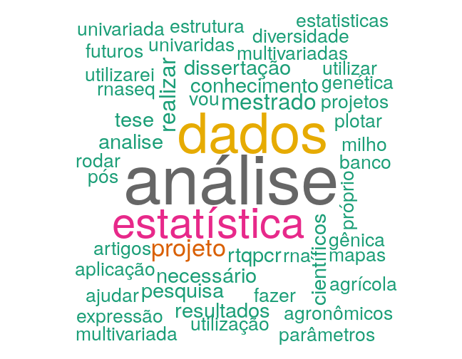

Por que o R?
========================================================
author: Treinamento em Programação no Ambiente R 
date: 17/05/2019
autosize: true

<div align="right">

</div>

========================================================
<h2 style="color:blue;">Perguntamos em 2018! (e perguntaremos novamente agora)</h2>



- Gráfico feito no R. Veja [como](http://www.sthda.com/english/wiki/text-mining-and-word-cloud-fundamentals-in-r-5-simple-steps-you-should-know).

========================================================
<h2 style="color:blue;">O que é o R?</h2>

- Uma linguagem e ambiente para análises estatísticas e gráficos
- Provinda da linguagem S 
- Desenvolvida no Bell Laboratories pelo John Chambers e colegas
- Oficialmente: "Preferimos pensar que é um ambiente dentro do qual técnicas estatísticas são implementadas."

========================================================
left:70%
<h2 style="color:blue;">Algumas capacidades</h2>

<small><ul style="list-style-type:disc">
  <li> Compatibilidade com qualquer plataforma</li>
  <li> Várias possibilidades de manipulação de dados</li>
  <li> Processamento rápido</li>
  <li> Lida bem com Big Data</li>
  <li> Automação e reprodutibilidade</li>
  <li> Relatórios e Apresentações (inclusive esta e as próximas)</li>
  <li> Estado da arte em gráficos (<a align="right" href="http://www.r-graph-gallery.com/"> belos exemplos</a>
) </li>
  <li> ... </li>
</ul>
</small>

***  


========================================================
<h2 style="color:blue;">Um projeto <em>GNU</em> 

</h2>
Free Software Foundation’s GNU general license:

- Rodar o programa para qualquer propósito
- Estudar como o programa funciona e adaptar isso aos seus interesses
- Distribuir cópias
- Aprimorar o programa e liberar para a comunidade acesso ao código fonte

<footer align="right" ><small> https://www.r-project.org/about.html</small></footer>

========================================================
<h2 style="color:blue;">Não é só pelo dinheiro!</h2>

["Software livre é referente à liberdade, não ao preço. Para entender o conceito, você deve pensar em "livre" como "liberdade de expressão", não como "open bar".](http://www.gnu.org/)

["Tira o poder dos desenvolvedores sob os usuários"](http://www.gnu.org/philosophy/free-software-even-more-important.html)

- No R são possíveis infinitas combinações

Extensível (pacotes):
- <a href="https://cran.r-project.org/index.html">CRAN</a> (14190 pacotes em 13.05.2019)
- <a href="https://bioconductor.org/">Bioconductor</a> (1741 pacotes em 13.05.2019)
- <a href="https://r-forge.r-project.org/">R-forge</a> (2095 pacotes em 13.05.2019)
- <a href="https://github.com/">Github</a>

=========================================
<h2 style="color:blue;">O poder da mentalidade colaborativa

</h2>

<font size="5">

<a href="http://augusto-garcia.github.io/statgen-esalq/Short-tutorial-about-Git/">Tutorial sobre o git</a>


<ul small style="list-style-type:disc">

<li><a href="https://github.com/collections/open-journalism">Jornalismo aberto</a></li>

<p style="margin-bottom:1cm;"> <a  href="https://github.com/fivethirtyeight/data">fivethirtyeight/data</a> - 37 contribuidores </p>


<li><a href="https://github.com/showcases/social-impact">Impacto social</a></li>

<p style="margin-bottom:1cm;"><a href="http://hospitalrun.io/">Free, easy-to-use software for developing world healthcare</a> - 90 contribuidores </p>

<li><a href="https://github.com/showcases/science">Ciência</a></li>
<a href="https://github.com/cms-sw/cmssw">Cmssw</a> - 
Partículas elementares Higgs Boson (2012), 3800 pessoas de 42 países diferentes, 645 contribuidores no github

<p style="margin-bottom:1cm;"><a href="https://github.com/Cristianetaniguti/onemap">OneMap</a> - 9 contribuidores
</p>

<p style="margin-bottom:1cm;"><li><a href="https://github.com/trending/r">Muitos outros pacotes do R</a></li></p>

<li> <a href="https://github.com/GENt-esalq/GENt-esalq.github.io">O site do GENt </a> (<a href="https://gent-esalq.github.io/">site</a>)- 2 contribuidores</li> 

</ul>

</font>


========================================================
<h2 style="color:blue;">Uma <em>Linguagem</em> de Programação </h2>

Nível de abstração das linguagens

- Mais baixo o nível, mais liberdades e mais difícil a aprendizagem


<font size="5">  

```r
cat("Feito em R!")
```

```
Feito em R!
```
</font> 

=======================================================
<h2 style="color:blue;"> Por que aprender a programar? </h2>

<font size="5.5">

- Divergência entre capacidade tecnológicas e aplicação

<a href="https://www.youtube.com/watch?v=xfBWk4nw440">You Should Learn to Program: Christian Genco at TEDxSMU</a> 

Apollo Guidance Computer (1961) x 1 milhão = Smartphone (hoje)


- Ainda há excesso de trabalho repetitivo
- 65% das crianças hoje terão empregos no futuro que ainda não existem (World Economic Forum)

</font>

========================================================
<h2 style="color:blue;">Incentivo à lógica de programação

</h2>

<a href="https://hourofcode.com/pt">Hour of Code</a> 


<a href="https://scratch.mit.edu/">Scratch</a> 

<a href="https://pt.coursera.org/">Coursera</a> 

<a href="https://pt.khanacademy.org/">Khan academy</a> 

<a href="https://www.codecademy.com/pt">Code academy</a> 

[Code school](https://www.codeschool.com/)

[edX](https://www.edx.org/)

[Github](https://github.com/collections/learn-to-code)


========================================================
<h2 style="color:blue;">Materiais disponíveis para aprendizagem de R
</h2>

Algumas sugestões:

- Manuais do [CRAN](https://cran.r-project.org/)

- Pacote interativo [Swirl](http://swirlstats.com/students.html)

- Canal do Youtube [The New Boston](https://www.youtube.com/playlist?list=PL6gx4Cwl9DGCzVMGCPi1kwvABu7eWv08P)

- Cursos do [Datacamp](https://www.datacamp.com/community/open-courses)

- Série de tarefas em [TryR](http://tryr.codeschool.com/)


=======================================================
<h2 style="color:blue;">Como aprender a programar?

</h2>

Curva de aprendizagem


=======================================================
<h2 style="color:blue;">Lidar com frustrações
</h2>

- Diferença de outros tipos de aprendizado
- Bravura x perfeição
[Teach girls bravery, not perfection | Reshma Saujani](https://www.youtube.com/watch?v=fC9da6eqaqg)


=======================================================
<h2 style="color:blue;">Dicas para o controle de pragas
</h2>

Termo "bug" por [Grace Hopper](https://en.wikipedia.org/wiki/Grace_Hopper) em 1947

- Vá aos poucos
- Identifique a linha do código onde esta o erro
- Google!
- Use o método científico: levante hipóteses e teste
- Deixe o erro facilmente reproduzível

***


=========================================
Para mais motivação:

TED talks:
- [Mitch Resnick: Let's teach kids to code](https://www.youtube.com/watch?v=Ok6LbV6bqaE)
- [My Experience of Using the Statistical Language R | Nathan Hadjiyski](https://www.youtube.com/watch?v=HtO40PR0fjM)

Vídeos motivadores:
- [Hour of code 1](https://www.youtube.com/watch?v=ip051U7Rvds) 
- [Hour of code 2](https://www.youtube.com/watch?v=FC5FbmsH4fw)
- [Incentivo do Obama](https://www.youtube.com/watch?v=6XvmhE1J9PY)

