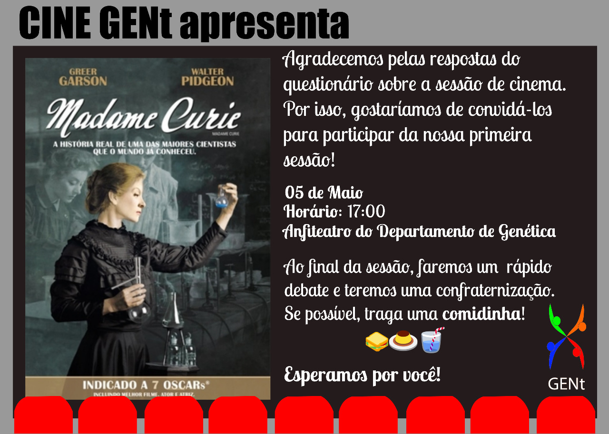

<figure>
  
</figure>

# Apresentação

A cada dois meses o GENt organiza uma sessão de cinema no Anfiteatro do Departamento de Genética. Os filmes são da temática de Genética e Melhoramento de Plantas e são sugeridos por professores e alunos. Após cada sessão, acontece uma roda de conversa sobre o tema abordado no filme.

Fiquem atentos com a programação! Caso tenham sugestões de filmes, nos comunique pelo email gent.esalq@gmail.com

## 1ª Sessão

O primeiro filme será "Madame Curie", produção de 1943 que retrata a vida da famosa cientista Marie Curie. A sessão iniciará às 17:00 no dia 05 de Junho no Anfiteatro do Departamento de Genética, logo após o seminário do Dr. Kaio Olímpio das Graças Dias. 

<figure>
  
</figure>

