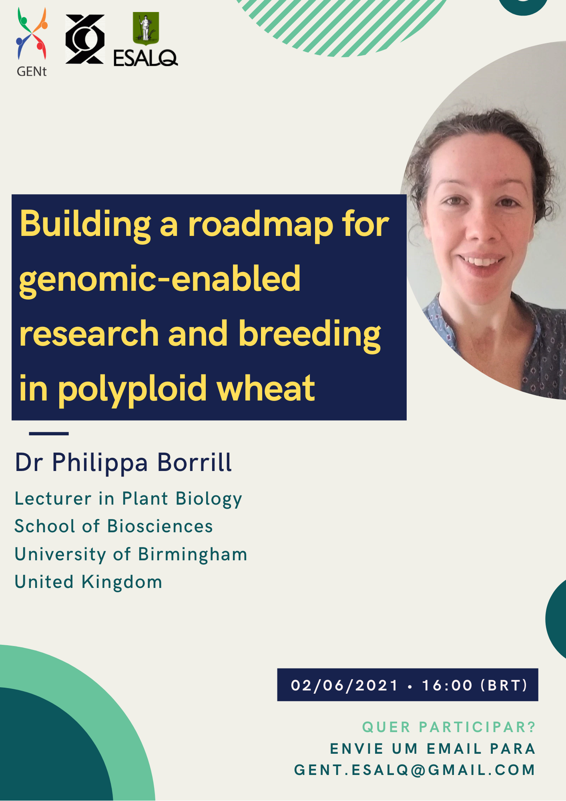

<figure>
  
</figure>

# Apresentação

 Como parte da programação de seminários do Departamento de Genética, o grupo GENt trouxe a professora Dra. Philippa Borrill para ministrar o seminário ‘Building a roadmap for genomic-enabled research and breeding in polyploid wheat’. 

 A Dra. Philippa Borrill se formou pela Universidade de Cambridge e é doutora em Biologia pelo John Innes Centre. Durante o doutorado, desenvolveu pesquisas sobre o fator de transcrição que regula o teor de nutrientes do grão de trigo. Desde 2018, ela lidera um grupo de pesquisa na Universidade de Birmingham, que estuda como o processo de desenvolvimento da senescência determina o teor nutricional do grão de trigo. 

  

 O trigo é uma cultura básica para bilhões de pessoas em todo o mundo, mas seu grande genoma poliplóide torna desafiadora a aplicação de abordagens modernas de melhoramento genômico. Nesta palestra, a Dra. Borrill delineará os avanços em genômica de trigo nos últimos 5 anos. Os novos recursos disponíveis fornecem uma plataforma com detalhes sem precedentes para o estudo de genes e características de interesse. Além disso, serão discutidas as maneiras como esses recursos são utilizados por pesquisadores do mundo todo. 
  

Contamos com a participação de todos.

**Data**:  02 de junho de 2021 

**Horário**: 16h

**Local**: Evento online

**Link para assistir**: https://youtu.be/gd9EOuXxOVk