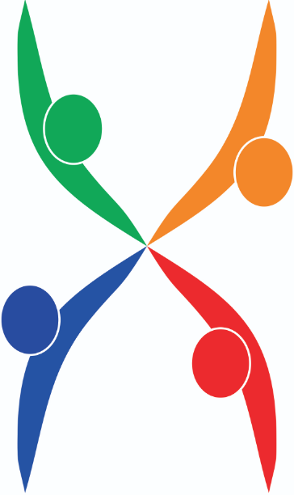
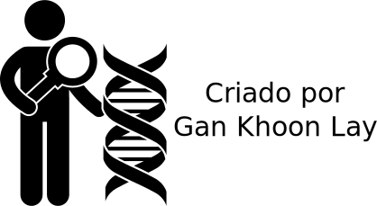
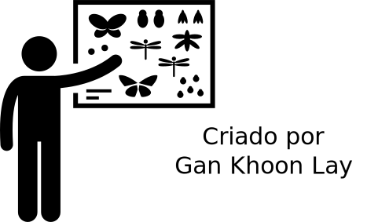
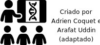

# Logo do grupo GENt

O logo do grupo foi elaborado por Fernando Espolador e Júlia Morosini. Eles trouxeram a imagem de quatro pessoas unindo as mãos ao centro da figura, que em outro ponto de vista forma um cromossomo duplicado. O grupo aderiu a imagem por acreditar que ela transmite sua proposta de levar conhecimentos em genética e promover maiores comunicações/união entre a comunidade e a academia.

# Ícones utilizados no site:

Os ícones abaixo foram obtidos no site [thenoumproject](https://thenounproject.com/), segue os autores de cada um deles:

 
 
 
 
 
 
 
 
 

# Template do site

O site fica hospedado em [um repositório aberto no github](https://github.com/GENt-esalq/GENt-esalq.github.io). Ficaremos felizes com contribuições!

O template utilizado é uma versão modificada do [Freelancer Jekyll theme](https://github.com/jeromelachaud/freelancer-theme).

