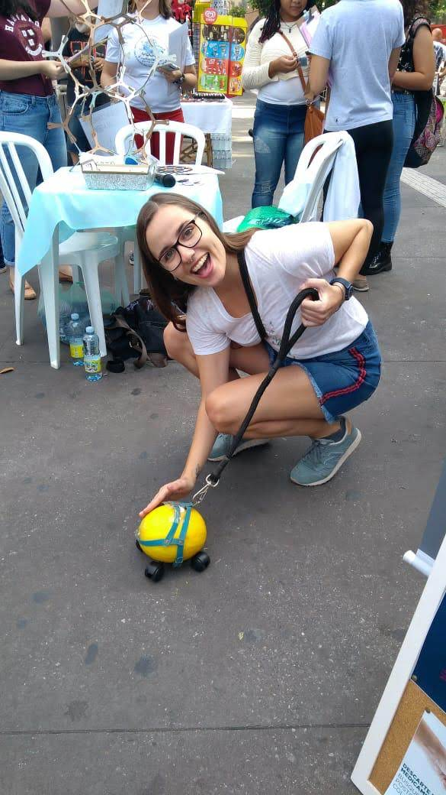
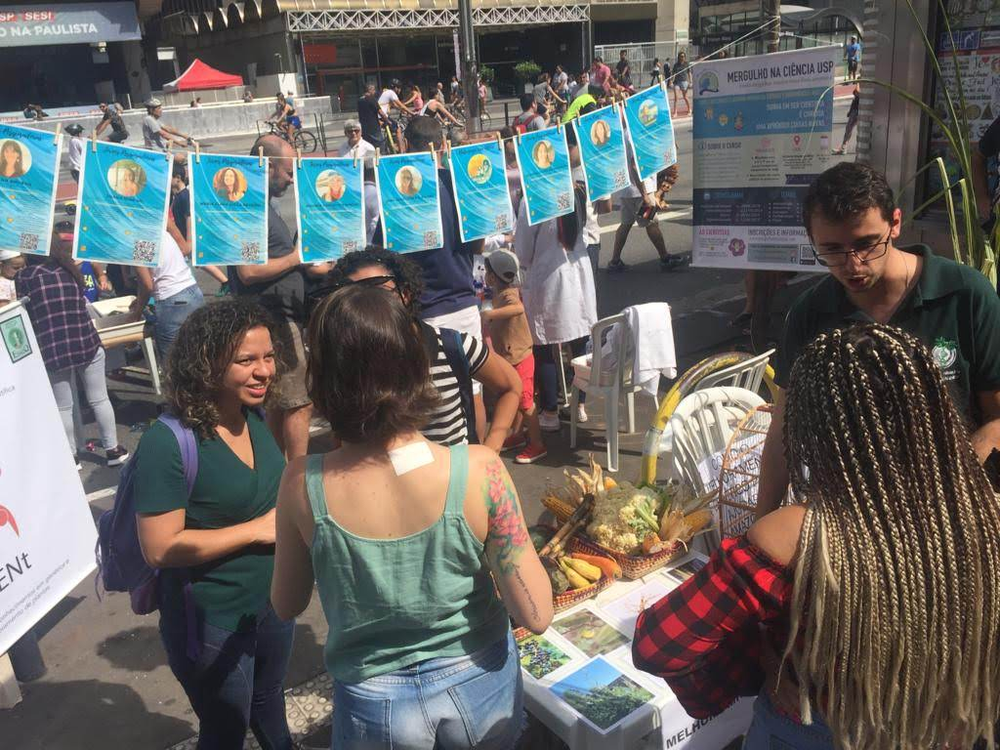
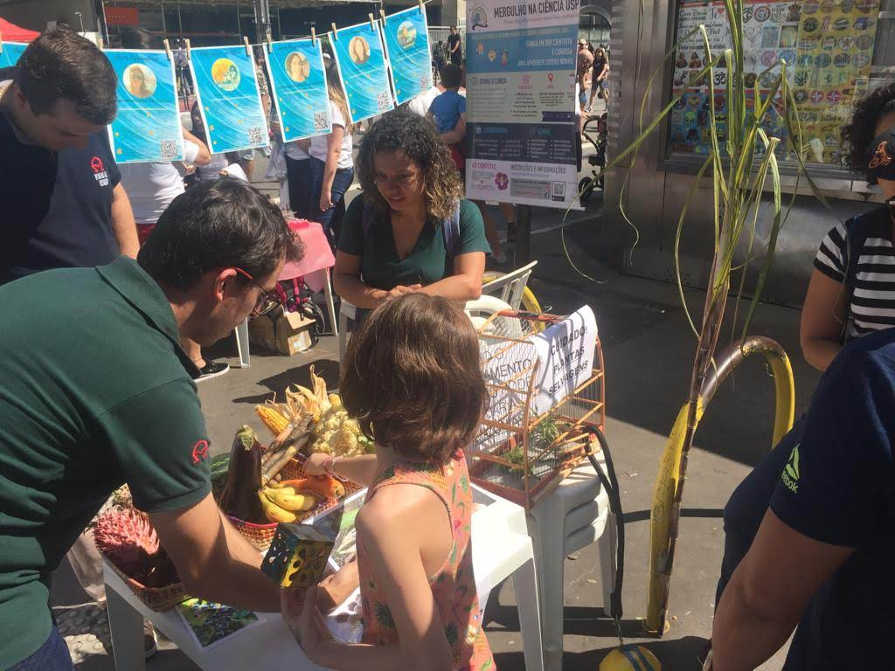
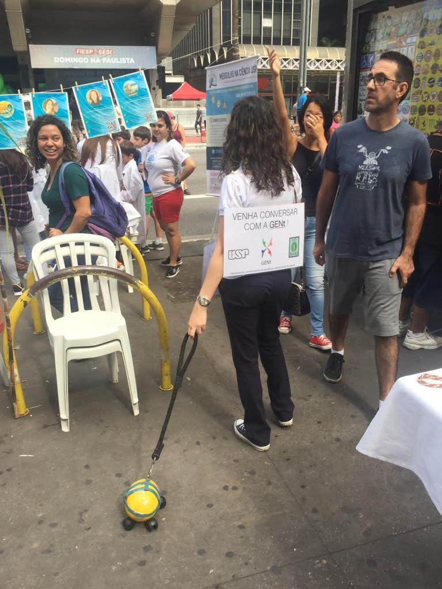

# IG Festival na Avenida Paulista (São Paulo - SP)

Fomos convidados a participar do IG Festival, um festival de divulgação científica que ocorreu no domingo, dia 5 de maio de 2019, na Av. Paulista, em São Paulo. O IG Festival foi o evento final do IGNITE Girls Camp, treinamento imersivo em divulgação científica só para mulheres, que ocorreu nos dias 2 a 4 de maio.

O IG Festival contou com os projetos das campistas, desenvolvidos ao longo do treinamento, assim como outros projetos de divulgação científica, como o Mergulhe na Ciência, o Instituto Sua Ciência e o Projeto Garatéa. O festival vem celebrar a importância da ciência, e da comunicação científica, para a sociedade. 

Na nossa opinião, medidas assim são de extrema relevância para aproximar a sociedade da academia. E como grupo, foi muito gratificante poder levar um pouquinho do que fazemos no nosso dia-a-dia para as ruas.

Para saber mais sobre o projeto IGNITE, acesse o site https://ignitescicomm.com/.

\vspace{0.5cm}

O objetivo do grupo GENt era apresentar os conceitos de domesticação e melhoramento genético de plantas. Elaboramos algumas atividades para fazer isso de forma divertida.

Levamos nosso melão domesticado para passear:

E algumas plantas selvagens (tivemos o cuidado de investir na segurança, para o bem do nosso público):

Também fizemos um jogo, o **MelhoraMico**! Nele, desafiamos o público a encontrar a versão domesticada das selvagens mostradas nas fotos. É claro que não era para ser uma tarefa fácil, mas muitos acertaram e todos ficaram surpresos com as grandes mudanças causadas pela domesticação. 

Aproveitamos a surpresa para contar como o melhoramento genético de plantas conseguimos pode gerar novas e vantajosas variedades em menos tempo, quando comparado com o processo de domesticação. 

A ideia era essa mesmo! Chamar a atenção e despertar a curiosidade com as atividades para gerar uma conversa. Nós aprendemos muito também ouvindo a experiência que cada um nos trouxe.

Se você é cientista, fique ligado nas nossas próximas atividades e junte-se à GENt pelas ruas! Nós adoramos a experiência!

