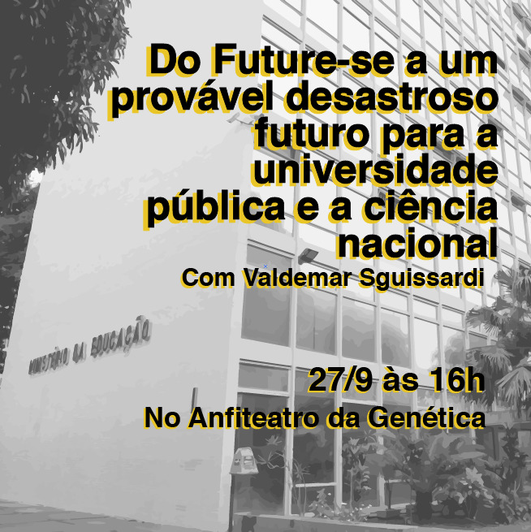

---
output:
  prettydoc::html_pretty:
    theme: cayman
    highlight: github
---

<figure>
  
</figure>

# Apresentação

 Diante de um preocupante cenário de corte de verbas e um possível desmonte da ciência e tecnologia no Brasil, nós, do grupo de GENt, acreditamos que o momento é de mobilização e união de forças entre os alunos de pós-graduação da ESALQ. Por isso, convidamos alunos, professores e funcionários da ESALQ para participar da palestra "Do Future-se a um provável desastroso futuro para a universidade pública e a ciência nacional", do professor Valdemar Sguissardi no Anfiteatro da Genética no dia 27 de setembro às 16h. 

 A pluralidade de saberes é fundamental para uma discussão consciente e embasada, e podem provocar reflexões mais profundas a cerca do momento atual que a Universidade Pública passa. O professor Valdemar Sguissardi é filosofo e professor titular aposentado da Universidade Federal de São Carlos. Atuou fortemente na área de estudos da educação superior, com enfoque na filosofia e história da educação.

  
Contamos com a participação de todos nesse crítico momento para a Universidade Pública.

**Data**: 27 de setembro (sexta-feira)

**Horário**: 16h

**Local**: Anfiteatro da Genética, Prédio da Genética.