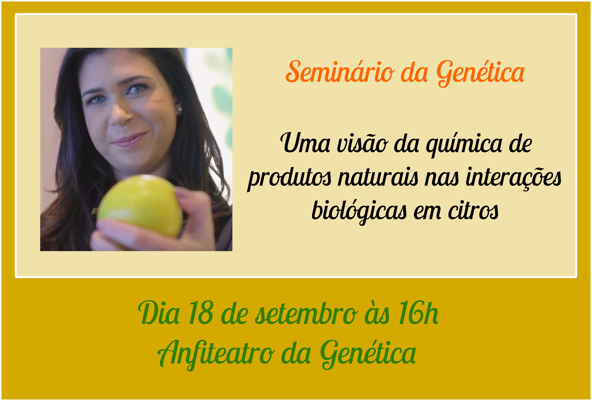

---
output:
  prettydoc::html_pretty:
    theme: cayman
    highlight: github
---

<figure>
  
</figure>

# Apresentação

 Como parte da programação de seminários do Departamento de Genética, o grupo GENt traz a professora Taícia Fill para ministrar o seminário 'Uma visão da química de produtos naturais nas interações biológicas em citros'. 

 A professora Taícia é química e professora doutora no Instituto de Química da Unicamp. Foi uma das ganhadoras do Programa L'oréal-Unesco-ABC para Mulheres na Ciência 2019. Sua pesquisa é focada no desenvolvimento de um fungicida natural para combater fungos que prejudicam a produção brasileira de laranjas. Confira o vídeo de divulgação das vencedoras do prêmio [aqui](https://www.youtube.com/watch?v=syF43AJ884U&feature=youtu.be). 

  
Contamos com a participação de todos.

**Data**: 18 de setembro (quarta-feira)

**Horário**: 16h

**Local**: Anfiteatro da Genética, Prédio da Genética.