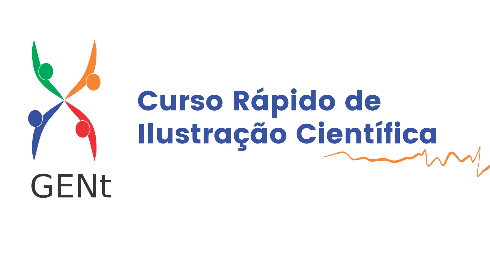

---
output:
  prettydoc::html_pretty:
    theme: cayman
    highlight: github
---

<figure>
  
</figure>

# Apresentação

 O Curso Rápido de Ilustração Científica mostrou algumas estratégias e ferramentas para o planejamento e elaboração de imagens para artigos científicos.   
  
O curso ocorreu no dia 02 de setembro de 2021, com transmissão ao vivo pelo YouTube e teve mais de 3.500 inscritos.   
  
A conversa foi conduzida pela integrante do GENt e doutoranda [Ana Letycia Basso Garcia](https://twitter.com/BassoLetycia) e pela Dra. e ilustradora [Patricia Sanae Sujii](https://www.instagram.com/psilustra/). 

  

 Você pode **assistir a gravação do curso [aqui](https://youtu.be/5wWZC0NJ7qc)** 

  A Patricia e a Ana Letycia também fizeram uma **apostila** com os principais pontos abordados no curso, que **você pode baixar [aqui](https://github.com/letyciabasso/curso_ilustracao_cientifica/raw/main/Apostila.pdf)**. 
