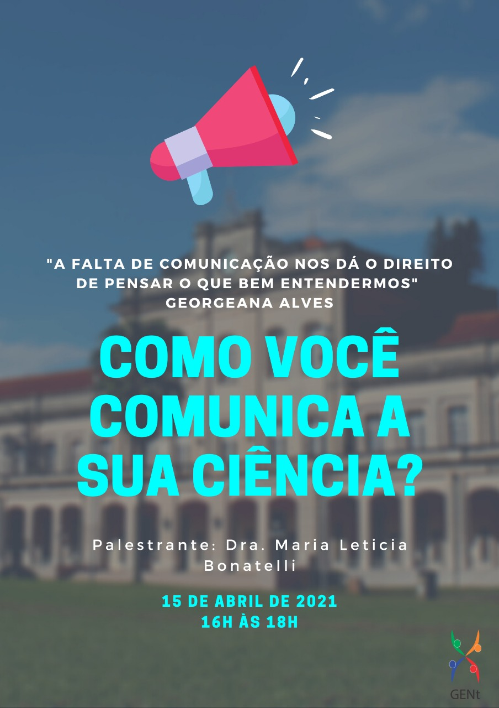

---
output:
  prettydoc::html_pretty:
    theme: cayman
    highlight: github
---

<figure>
  
</figure>

# Apresentação

 A comunicação científica ocorre em diversas esferas, seja entre os colegas de pesquisa do seu laboratório, nos congressos científicos ou na produção de artigos. Mas ela pode ir além. Como se comunicar de maneira clara com os seus vizinhos, com o vereador da sua cidade ou até mesmo com as agências de fomento? 

 A oficina do GENt "Como você comunica a sua ciência" trouxe ferramentas para os participantes adaptarem o discurso científico a diferentes cenários. O curso foi aberto e contou com a participação de pessoas do país inteiro! O curso ocorreu no dia 15 de abril de 2021 e foi ministrado pela Dr. Maria Letícia Bonatelli. 

  
**Data**: 15 de abril de 2021