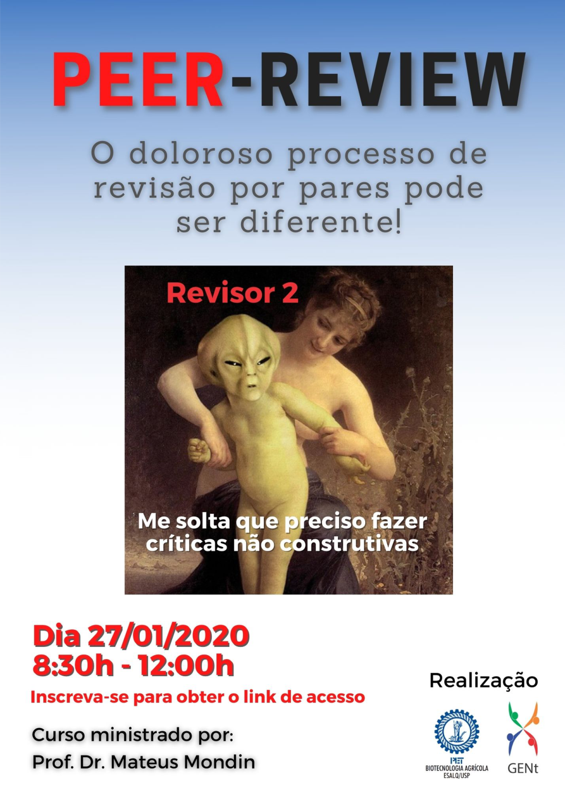

---
output:
  prettydoc::html_pretty:
    theme: cayman
    highlight: github
---

<figure>
  
</figure>

# Apresentação

 O curso de Comunicação Científica "Revisão por pares: como eu posso melhorar o processo de geração de conhecimento?" teve como objetivo oferecer aos alunos uma introdução sobre o processo de revisão por pares. No curso, os alunos conheceram as boas práticas desse processo, tanto na revisão de artigos, como de projetos, de forma a colaborar com a construção de uma ciência mais colaborativa. 

 O curso foi ministrado pelo professor Mateus Mondin, e ocorreu no dia 27 de janeiro de 2021 e foi uma realização dos grupos GENt e PET, sendo ofertado aos alunos do Departamento de Genética da ESALQ/USP 

  

**Data**: 27 de janeiro de 2021